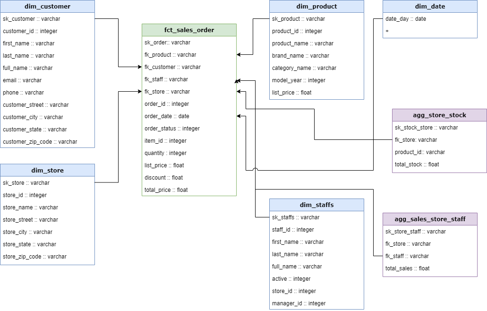

# Projeto Copilot AE

### Modelo Conceitual

### Métricas utilizadas com os dados
- Total de Vendas: Uma métrica simples que representa o valor total das vendas realizadas em um determinado período de tempo. Isso pode ser calculado somando o valor total de todos os pedidos.

- Número de Pedidos: Representa o total de pedidos realizados em um determinado período de tempo. Isso pode ajudar a entender a demanda por produtos ou serviços.

- Valor Médio de Venda por Pedido: Calculado dividindo o valor total das vendas pelo número de pedidos. Isso ajuda a entender o valor médio das transações realizadas.

- Quantidade Total de Produtos Vendidos: Representa o total de produtos vendidos em um determinado período de tempo. Isso pode ajudar a entender a demanda por diferentes produtos e identificar os produtos mais populares.

- Valor Total de Vendas por Cliente: Calculado somando o valor total das vendas para cada cliente. Isso ajuda a identificar os clientes de alto valor e entender o comportamento de compra de cada cliente individualmente.

- Taxa de Conversão por Canal de Vendas: Calculado dividindo o número de pedidos pelo número de visitantes ou leads para cada canal de vendas. Isso ajuda a avaliar a eficácia de cada canal em converter leads em clientes.

- Nível de Estoque Atual: Representa a quantidade atual de produtos disponíveis em estoque para cada loja e produto. Isso permite monitorar o nível de estoque em tempo real e identificar possíveis escassezes ou excessos.

- Estoque Mínimo: Define o nível mínimo de estoque que deve ser mantido para evitar falta de produtos. Isso é calculado com base na demanda histórica, tempo de reposição e risco de falta de estoque.

- Estoque Máximo: Representa o nível máximo de estoque que deve ser mantido para evitar excesso de produtos. Isso é calculado com base na demanda prevista, capacidade de armazenamento e custo de manutenção de estoque.

### Using the starter project

Try running the following commands:
- dbt run
- dbt test

### Resources:
- Learn more about dbt [in the docs](https://docs.getdbt.com/docs/introduction)
- Check out [Discourse](https://discourse.getdbt.com/) for commonly asked questions and answers
- Join the [chat](https://community.getdbt.com/) on Slack for live discussions and support
- Find [dbt events](https://events.getdbt.com) near you
- Check out [the blog](https://blog.getdbt.com/) for the latest news on dbt's development and best practices
